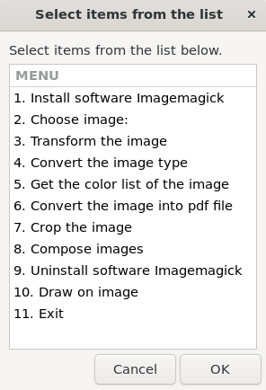

# ImageWizard

    

## Description
ImageWizard is a versatile Bash script application for image editing and transformation. It leverages `ImageMagick` for image manipulation and `Zenity` for GUI dialogs, providing an intuitive user interface for a variety of image processing tasks.

## Features
- **Install ImageMagick**: Easily install the ImageMagick software if it's not already installed.
- **Choose Image**: Select an image from your file system for editing.
- **Transform Image**: Apply various transformations including scaling, converting to black-and-white, applying negative effects, adding borders, rotating, adding watermarks, and adjusting colors.
- **Convert Image Type**: Change the image format to different file types.
- **Get Color List**: Generate a list of colors present in the image.
- **Convert to PDF**: Convert image files into a single PDF document.
- **Crop Image**: Crop the image to specified dimensions.
- **Compose Images**: Combine multiple images into one, either horizontally or vertically.
- **Uninstall ImageMagick**: Remove the ImageMagick software if no longer needed.
- **Draw on Image**: Draw various shapes (lines, rectangles, circles, triangles) on the image.
- **Apply Artistic Filters**: Apply artistic filters like oil painting, sketch, watercolor, and vintage effects to the image.

## Usage
Run the script with the following options:
- `-h` : Display help information.
- `-v` : Display version information.
